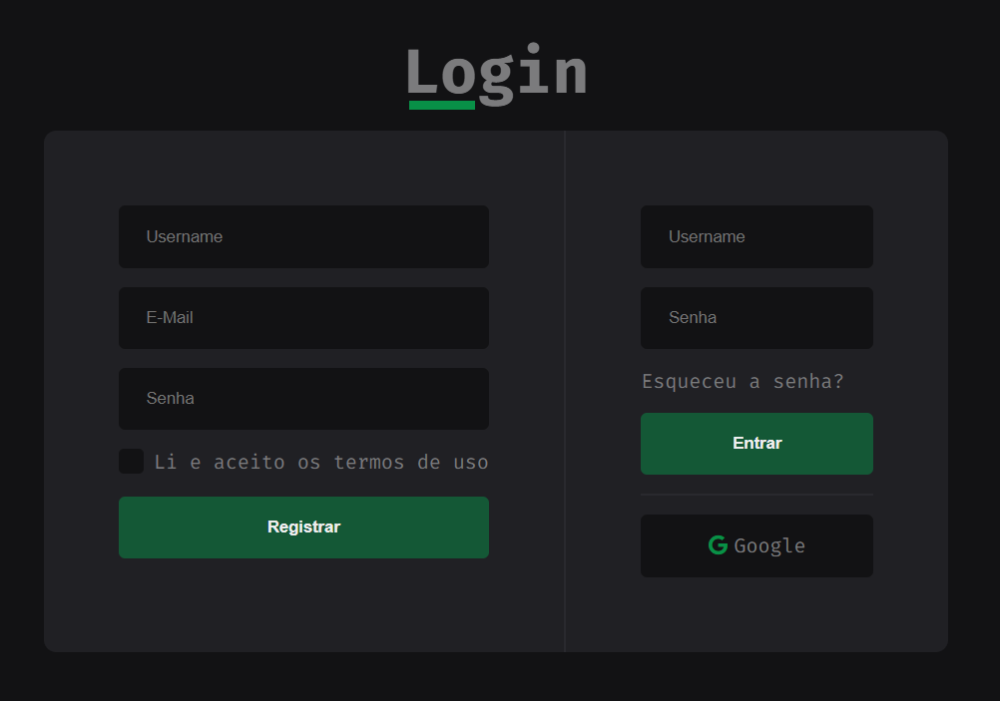

<h1 align="center">
  
  Bem Vindo ao Login
</h1>
<p align="center">
  📃 Front-end para página de login construido com HTML, CSS e JavaScript nativo
</p>

<p align="center">



</p>

<p align="center">
  
  <a href="#" target="_blank">
    
  </a>
  <a href="http://teste.netlify.app/doc" target="_blank">
    
  </a>
  <a href="https://twitter.com/Wesley_AllanS" target="_blank">
    
  </a>
</p>

### ✨ [Página](https://wesleyallan.github.io/login)

<br />

## 📨 Instalar

Projeto simples com HTML e CSS puro, ou seja, assim não havendo necessidade de instalações extras.

```sh
git clone https://github.com/wesleyallan/login.git
```

## ⚙️ Executar

Para a execução do projeto basta haver um browser instalado, e abrir o arquivo `index.html`, seja por linha de comando ou pelo atalho `Ctrl + O` com o browser aberto.

```sh
cd login
[browser] index.html
```

## 👤 Autor

**Wesley Silva**

- Website: [wesleyallan.dev](https://wesleyallan.dev)
- Twitter: [@Wesley_AllanS](https://twitter.com/Wesley_AllanS)
- Github: [@wesleyallan](https://github.com/wesleyallan)
- LinkedIn: [@wesleyallan](https://linkedin.com/in/wesleyallan)

## Mostre seu apoio

Dê um ⭐️ se esse projeto te ajudou!
